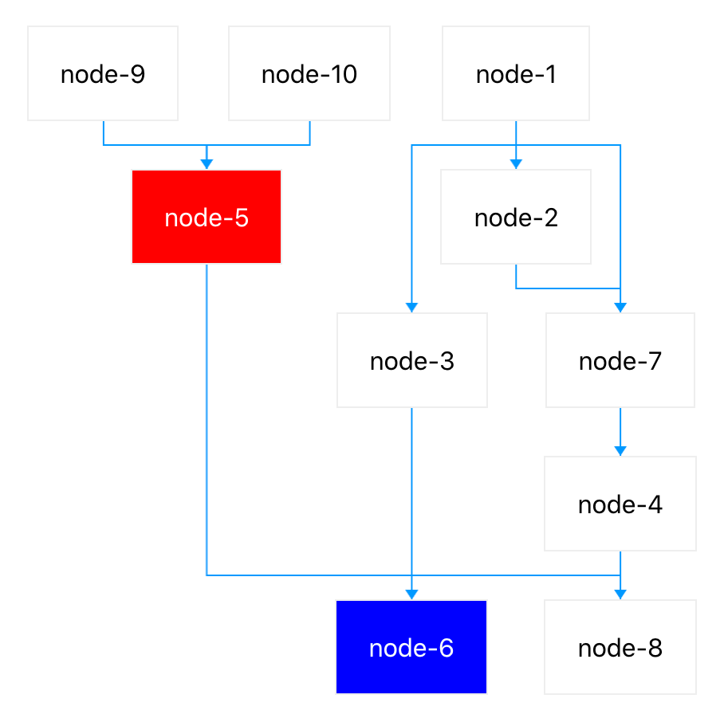

Workflow for React
==================

> Workflow for react with sugiyama layout algorithm.

[](https://www.npmjs.com/package/flow-kit)
[](https://www.npmjs.com/package/flow-kit)
[](https://snyk.io/test/github/d-band/flow-kit?targetFile=package.json)

## Install

```bash
$ npm install flow-kit --save
```

## Usage

[View demo online](https://d-band.github.io/flow-kit/)

```jsx
import React from 'react';
import { render } from 'react-dom';
import Workflow from 'flow-kit';

const data = {
  nodes: [
    { id: 1, name: 'node-1', },
    { id: 2, name: 'node-2' },
    { id: 3, name: 'node-3' },
    { id: 4, name: 'node-4' },
    { id: 5, name: 'node-5', className: 'node-red' },
    { id: 6, name: 'node-6', className: 'node-blue' },
    { id: 7, name: 'node-7' },
    { id: 8, name: 'node-8' },
    { id: 9, name: 'node-9' },
    { id: 10, name: 'node-10' }
  ],
  edges: [
    { from: 1, to: 2 },
    { from: 1, to: 3 },
    { from: 2, to: 7 },
    { from: 4, to: 6 },
    { from: 4, to: 8 },
    { from: 5, to: 6 },
    { from: 7, to: 4 },
    { from: 1, to: 7 },
    { from: 9, to: 5 },
    { from: 10, to: 5 },
    { from: 3, to: 6 }
  ]
};

const renderNode = (v) => (
  <div>
    {v.name}
  </div>
);

render(
  <Workflow
    data={data}
    renderNode={renderNode}
  />,
  document.getElementById('root')
);
```



## Report a issue

* [All issues](https://github.com/d-band/flow-kit/issues)
* [New issue](https://github.com/d-band/flow-kit/issues/new)

## License

flow-kit is available under the terms of the MIT License.
